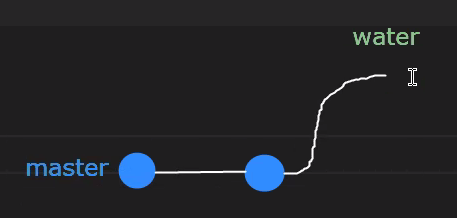
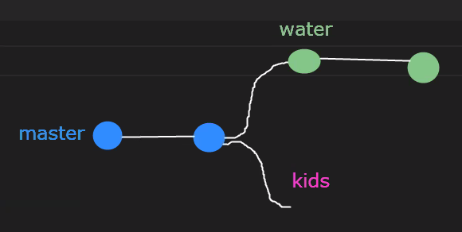
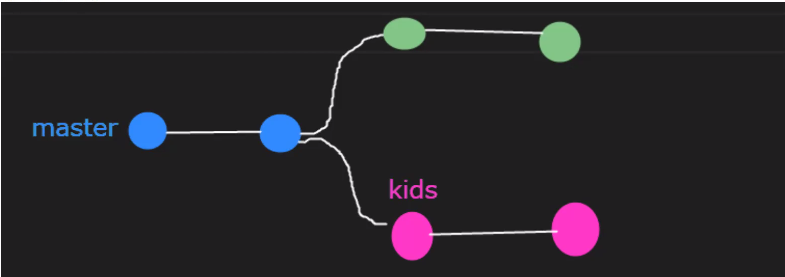
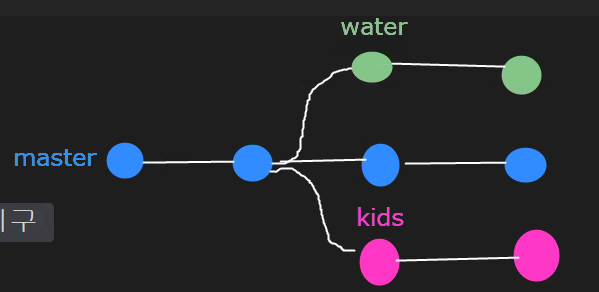
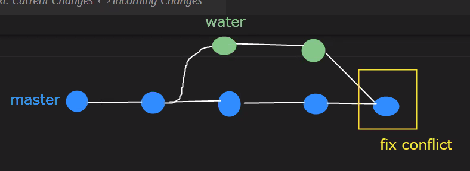
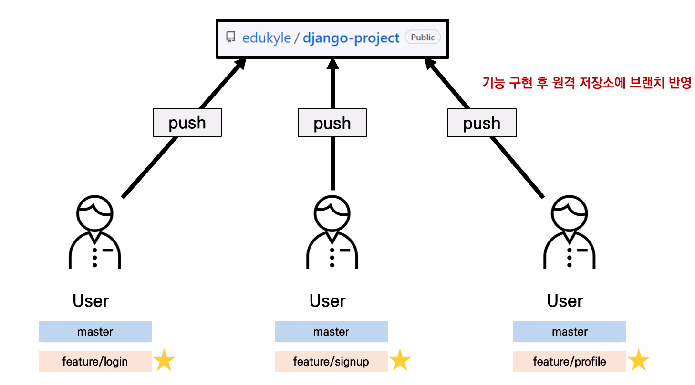
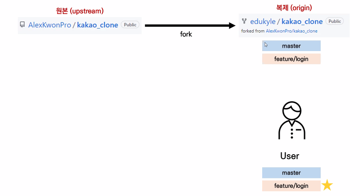

# 두번째 날
rm -r .git/하면 init 초기화
깃허브에서 편집하지 마라 -> 충돌난다

첫째날 한 방식: **상향식**
- 로컬깃에서 저장한 파일들을 깃허브에 push했으니까


## 하향식

git clone 주소 URL 레포명칭
- 레포지토리를 복제
- 복제를 했기 때문에 git init, get remote설정 안해도 됨
- origin은 길 이름
- 원래 레포지토리(깃허브)에서 복제 리포지토리로 파일을 보내는 것

- git pull origin master로 파일 옮기기


## 하향식 과정

 - TIL로 가서 code누른 후 url 복사(https://github.com/taehwan-kang/TIL.git)
 - git bash 열기 
 - git clone https://github.com/taehwan-kang/TIL.git TIL-home
 - ls명령어를 통해 TIL-home 레포지토리가 생긴것을 확인
 - cd TIL-home/
 - git remote -v 확인
    - 따로 경로를 설정해주지 않았어도 깃허브와 연결이 되어있음


## bash에서 바로 vscode 열기

- code .
- TIL에 있던 내용들 다 포함


## TIL레포지토리에서 pull

- TIL-HOME에서 day02.md 생성
- git add .
- git commit -m ''
- git push origin master
- git log --oneline으로 확인
    - 왼쪽 노란색 값들은 해쉬값: 각각의 파일들의 고유한 주소
- TIL 레포지토리로 가서 bash로 vscode열기
- TIL 로컬 레포지토리에서는 day02.md추가 안됐음
- git pull origin master
    - day02.md가 TIL로컬 레포지토리에 받아진것을 확인


## 깃허브상에서 md파일을 수정하여 conflict가 날 경우

- 모르고 로컬에서 push하면 오류뜸
- 먼저 깃허브에서 git pull origin master 해야함
- conflict뜬 부분이 나오는데 클릭으로 무엇을 받아들일지 선택
- git add, git commit으로 merging상황 해결
- git log --oneline을 통해 상황 파악
- 이제 push 가능

만약 origin 말고 다른 이름을 쓰고싶으면 clone 한 이후에 git remote rename origin "원하는거" 적어주면 됨


## 브랜치

1. 브랜치란??(branch)
> 버전관리의 꽃


## 브랜치는!

- 나뭇가지처럼 **작업 영역**을 여러개로 나누어서 <u>독립적으로</u> 작업할 수 있게 함

  

## 왜?! 브랜치를 써야할까?!

- 예시: `카카오 개발자` ->카카오톡의 채널 탭을 신규 개발하라는 과업
  
  
  
  - **1번)** ~~master branch에서 그대로 작업한다~~
    
    - master: 이미 상용화되어 서비스되고 있는 곳
      - 이미 세상에 나와있는 서비스
    - 작업하다가 에러가 난 경우?: 작업하다가 전체가 장애생긴 경우
      - 카카오톡 대국민 사과각 -> 비즈니스적 마이너스
    
    
    
  - **2번)** 신규 개발을 위한 branch를 생성하여 작업한다
  
    - 신규로 branch 생성 -> 작업 -> 버그 처리 -> QA
    - 작업 완료된 기능을 다시 master에 수행
    - 독립된 공간에서 작업을 하기 때문에 어떠한 에러, 버그와 무관하게 작업 가능


## 브랜치 관련 명령어

1. git branch

> 조회, 생성, 삭제

```bash
# 브랜치 목록을 조회
git branch

# 원격 저장소의 브랜치 목록을 포함하여 조회
git branch -r

# 신규 브랜치 생성
# 지금까지 master에 쌓인 모든 커밋이 포함된 브랜치
git branch 브랜치명

# 커밋 아이디를 기준으로 브랜치 생성
# 커밋 아이디: git log에서 노란색
git branch 브랜치명 커밋ID

# 브랜치를 삭제
# 병합완료된 브랜치들만 삭제 가능
git branch -d 브랜치명

# 병합완료되지 않은 브랜치들 삭제
git branch -D 브랜치명
```

2. git switch

> 포인터 HEAD, 경로 옆 괄호 표시를 보고 확인 가능하다
>
> > master, 브랜치명 등등...

```bash
# 다른 브랜치로 이동
git switch 이동하고자 하는 브랜치명

# 브랜치 생성과 동시에 이동한다
git switch -c 브랜치명

# 커밋 아이디를 기준으로 브랜치 생성과 동시에 이동
git switch -c 브랜치명 커밋ID
```


## 브랜치 실습

1. 준비

   - 홈폴더에 branch-practice폴더 생성 후 vscode 실행

   - attraction.txt파일 생성: touch attraction.txt

   - git init

   - attraction 파일 내부에 내용 채우기

   - git add .

   - git commit -m 'initialize'

2. attraction 수정 후 5, 6 진행

   - 여기까지 마스터 브랜치에 두 레포지토리가 찍힌 것
   - 이후 작업을 위해 신규 브랜치를 생성할 것(water)



3. git branch water

   - 아무 결과도 안나옴

   - git branch를 통해 브랜치 확인

   - 브랜치 이동 필요

4. git switch water
   - water브랜치로 바뀐것을 확인

5.  attraction파일 수정
   - 이후 add, commit과정
   - git log --oneline으로 확인
     - HEAD(포인터)가 water에 있는것을 확인
     - git switch master



6. git switch -c kids
   - attraction 파일 수정 이후 5~6반복

7. git log --oneline --all --graph
   - 브랜치 구조 파악 가능

8. git switch master

---

 지금까지 브랜치 통해서 독립된 작업 공간에서 만드는 것 까지 진행



작업이 끝나고 나면, master 브랜치에 병합해서 서비스 운영할 수 있도록 해야 함

**병합** -> `merge`

- git merge
  - 분리된 브랜치 합치는 명령어

```bash
# 남겨질 브랜치 위치에서 진행하면 된다.
# master로 이동한 다음 merge하면 master로 병합됨
git merge 합칠 브랜치 이름
```


## 브랜치 병합

1. kids 브랜치를 master에 병합
   - git merge kids
   - kids 브랜치는 이제 필요없기 때문에 삭제



2. kids 브랜치 삭제
   - git branch -d kids(병합완료됐기 때문에)
   - git branch -D(병합이 안됐을 경우)
   - 이후 git branch를 통해 확인해 보면 master, water 두개만 남음


---

## 충돌(conflict)

먼저 water브랜치로 이동

- water의 내용과 kids+master의 attraction.txt 내용 다른것을 확인

master로 이동 후 git branch로 확인 

1. git merge water 시도
   - confict 생김
   - 둘 다 선택(Accept Both Changes 클릭)

2. 저장 후 add, commit
3. git log --oneline --all -graph로 확인 -> 모두 병합됐음



4. water branch 삭제
   - git branch -d water
   - git log --oneline --all --graph로 확인

브랜치를 옮기기 전에 작업했던 것들은 커밋해놓아야 함(최소 add)

---
## Pull Request

1. 로컬에서 브랜치를 만든 후
2. git push origin branch명
3. pull request를 해야 함 -> 다른 사람들에게 merge에 대한 심사를 받아야 함
4. 이후 pull로 new branch의 변경사항들의 기록들만을 로컬 브랜치로 가지고 온다


---

## Git workflow: Branch와 Pull request를 이용한 협업

1. Feature Branch Workflow

   - Shared repository model(저장소의 소유권이 있는 경우)
   - 하나의 저장소에 여러명이 협업할 때
   - 각 사용자는 원격 저장소의 소유권을 가짐
   - 원격 저장소를 clone, 각 사용자는 master
   - 각각이 clone에 역할분담별로 브랜치 생성
   - 이후 작업한 브랜치 자체를 원격 저장소에 Push

   

   - 이후 pull request보내고 reviewer가 판단 후 merge, 병합 완료 된 브랜치는 깃허브상에서 삭제
   - 이후 병합된 마스터 브랜치를 각 유저에게 pull, 유저 개인의 브랜치는 필요 없으므로 삭제

2. Forking Workflow

   - 소유권이 없는 원격 저장소를 fork를 통해 복제

   - 이후 클론으로 로컬 리포지토리에 복사

   - 추후 로컬 저장소를 원본 원격 저장소와 동기화하기 위해 URL을 연결(git remote add upstream 원본URL) - 원본 저장소에서 수정된 부분을 가져오기 위해

     

   - 기능 구현 후 원격 clone 저장소에 브랜치 반영(git push origin login)

   - 이후 clone 원격 저장소에서 원본으로 pull request 보냄

   - 병합한 후 clone에서는 login브랜치 삭제

   - user는 원본 원격 저장소 pull 받고 로컬 브랜치 삭제

---

# git 특강의 후기를 남겨주세요 :)
> 하단 작성되어 있는 workflow에 따라 Fork와 Pull request를 실습해 봅시다.

1. 우측 상단 `[fork]` 버튼을 눌러 주세요.  
여러분들의 계정으로 해당 repository가 가져와 집니다.
    

2. 여러분들의 계정 속 `review-0318` 저장소로 들어 가세요.  

3. 초록색 `[code]` 버튼을 누르고, URL 우측 버튼을 통해 이를 복사해 주세요.  
    사진 상에 가려져 있는 부분에 여러분들의 **깃허브 닉네임**이 있어야 합니다.
    
  
4. 복사한 url을 가지고 원격 저장소를 로컬에 clone해 주세요.

5. 신규 브랜치를 만들어 주세요.

6. 새로 만든 브랜치로 이동합니다.

7. 여러분들의 이름으로 된 md 파일(예시 : `chelsea.md`)을 만들고, 2일 간의 git특강에 대한 리뷰를 작성해주세요.

8. 파일을 저장하고, 변경사항을 기록합니다.

9. 브랜치의 변경사항을 담은 기록들을 push합니다.

10. github 상에서 pull&request를 보냅니다.


Git Repository - Setting - Colaborator에서 권한을 줄 수 있음(invite)

심화 내용: https://git-scm.com/book/ko/v2
